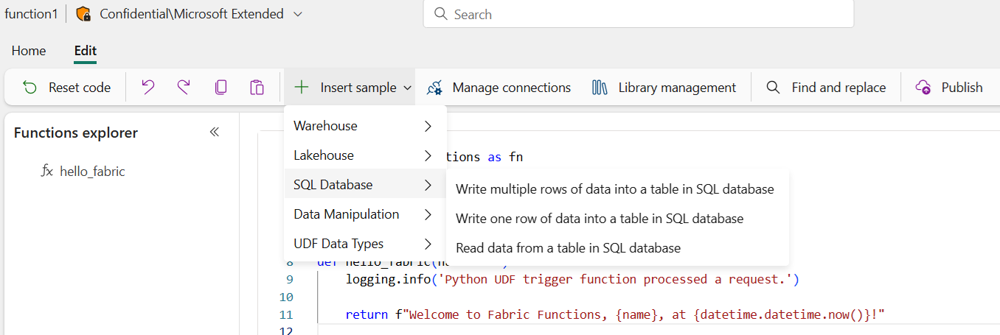
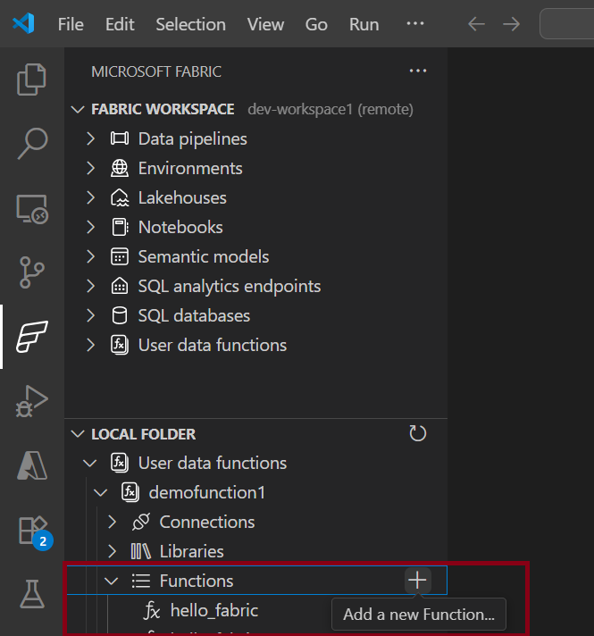
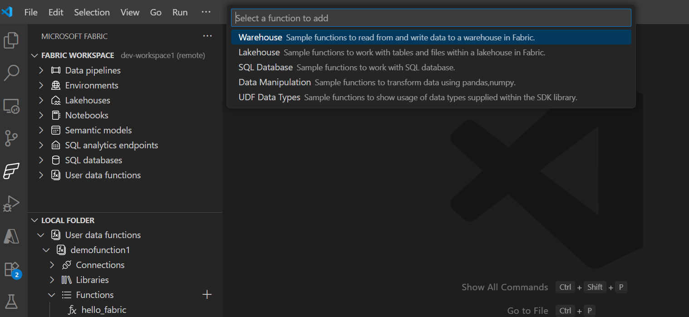

# Fabric User data functions Samples 
You can find these sample code snippets for functions that can be used in Fabric User data functions.  These functions can also be available to users in Fabric portal and VS Code. The text in the sample file will be inserted at the end of the function_app.py file.

**Fabric portal**



**Fabric User data functions in VS Code**
1. Select ~**Local folder** and open **Functions**. Select **+** to add a new function from a sample. 

2. View all the sample categories to select a sample to add within function_app.py.


 

## Contributing 

You can contribute to more function samples here. Follow the structure and checklist below:

### Contribution Checklist

Before submitting your sample function, ensure you complete all the following steps:

#### 1. Code Preparation
- [ ] Write your sample function with proper docstring following the format:
  ```python
  '''
  Description: Brief description of what the function does
  
  Args:
  - param1 (type): Description of parameter
  
  Returns: type: Description of return value
  '''
  ```
- [ ] **DO NOT** include these lines in your code (they exist in the base function_app.py):
  ```python
  import fabric.functions as fn
  udf = fn.UserDataFunctions()
  ```
- [ ] Start with a comment block describing the code and any special requirements
- [ ] Include necessary import statements for libraries used in your function
- [ ] Use appropriate decorators (`@udf.function()`, `@udf.connection()`, etc.)

#### 2. File Organization
- [ ] Create your sample file as `<sample_name>.py` in the `PYTHON` folder
- [ ] Choose an appropriate subfolder or create a new one if existing subfolders don't match your content:
  - `Warehouse/` - Functions working with Fabric warehouses
  - `Lakehouse/` - Functions working with Fabric lakehouses  
  - `SQLDB/` - Functions working with SQL databases
  - `DataManipulation/` - Functions for data transformation and analysis
  - `UDFDataTypes/` - Functions demonstrating UDF SDK data types
  - Create new subfolder if your sample doesn't fit existing categories

#### 3. Index.json Update
- [ ] Update the appropriate `PYTHON/index.json` file
- [ ] Add your sample entry with:
  - [ ] Descriptive `name` (shown in bold in QuickPick)
  - [ ] Clear `description` (shown at end of first line)
  - [ ] Optional `detail` (shown on second line)
  - [ ] Current `dateAdded` in ISO format (e.g., "2024-12-07T00:00:00Z")
  - [ ] Correct `data` path relative to PYTHON folder
- [ ] Ensure JSON syntax is valid (no trailing commas, proper brackets)

#### 4. Testing and Validation
- [ ] Verify your function follows Fabric UDF patterns
- [ ] Test that required libraries are commonly available or document special requirements
- [ ] Ensure function handles errors appropriately
- [ ] Validate that the function serves a practical use case

#### 5. Documentation
- [ ] Include clear examples in your docstring
- [ ] Document any special setup requirements in comments
- [ ] Specify any external dependencies needed

#### 6. Submission
- [ ] Submit a Pull Request (PR) to the repository
- [ ] Include a clear description of what your sample does
- [ ] Mention any new dependencies or requirements
- [ ] Wait for product team review and address any feedback

### Sample Structure Example

```python
# This sample demonstrates how to process data using pandas
# Requires: pandas library for data manipulation

import pandas as pd

@udf.function()
def my_sample_function(data: list) -> dict:
    '''
    Description: Process input data and return summary statistics
    
    Args:
    - data (list): List of dictionaries containing numeric data
    
    Returns: dict: Summary statistics including mean and count
    '''
    df = pd.DataFrame(data)
    return {"mean": df.mean().to_dict(), "count": len(df)}
```


## Index.json 
Index.json defines all the functions that are listed when creating a function in VS Code or Fabric portal. Each tree level is a QuickPick input for the user:


index.JSON Format:

```typescript
export interface ISampleFunction {
    name: string; // shown in BOLD on 1st line of QuickPick Item
    description: string; // shown at end of 1st line of QuickPick Item
    detail?: string; // shown on 2nd line of QuickPick Item
    dateAdded?: string; // date added to the repo, so we can sort/filter, like '2024-08-31T17:50:52.184Z'
    tag?: string; // additional tag to filter on
    data: ISampleFunction[] | string; // if string, it's the full relative path file name from root to download. Else it's an array of ISampleFunction
}
```

Additional filtering, sorting by user may be added in the future with tag, dateAdded

NOTE: These are not complete runnable samples. They are snippets that are inserted in User data function item in Fabric. 

