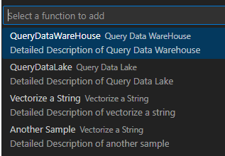

# fabric-user-data-functions
Samples for fabric user data functions 


User can select function samples.
Samples are categorized first by runtime (DOTNET, PYTHON) using folders
Then can be hierarchical with recursive JSON. Each tree level is a QuickPick input for the user:

 

index.JSON Format:


```typescript
interface ISampleFunction {
    name: string; // shown on 1st line of QuickPick Item
    description: string; // shown at end of 1st line of QuickPick Item
    detail?: string; // shown on 2nd line of QuickPick Item
    dateAdded?: string; // date added to the repo, so we can sort/filter
    tag?: string; // additional tag to filter on
    data: ISampleFunction[] | string; // if string, it's the file name to download. Else it's an array of ISampleFunction
}

```

Additional filtering, sorting by user may be added in the future with tag, dateAdded
These are not complete runnable samples: they are snippets that are inserted.

Start with a comment block describing the code, indicating any changes in usings/packagereferences or imports/requirements.txt

# DOTNET Samples
Indent the sample by 8 spaces: the text will be inserted in the FabricFunctions.cs  before the last 2 closing braces


# PYTHON Samples
The text will be inserted at the end of the function_app.py file
